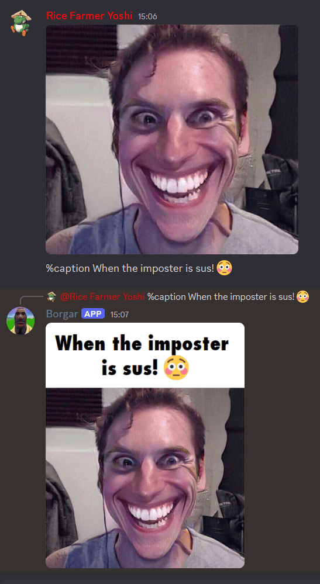

# Borgar

Discord bot that provides fun image editing commands, such as image captioning. View the list of commands with `/help`.



## Prerequisites

- **Java 17 SDK or higher**: Ensure you have the correct version of Java installed to build and run the bot.
- **IntelliJ IDEA**: Recommended for project setup and development.
- **Discord Bot Token**: You need a bot token from the [Discord Developer Portal](https://discord.com/developers/applications) to run Borgar.

## How to import this project in IntelliJ IDEA
1. In the IDEA main menu, select `Import Project` (or `File` → `Open…` if you already have a project open).
2. Select the project's `build.gradle.kts` file to import the project.
3. Go to `File` → `Project Structure` → `Project Settings` → `Project` and set `SDK` to a Java 17 or higher SDK.
4. Optional, but recommended: By default, IntelliJ delegates to Gradle to build the project. This is unnecessary for this project and causes longer build times. To make it use the builtin compiler:
   1. Open the `Gradle Settings` dialog from the Gradle tab.
   2. Change the `Build and run using` and `Run tests using` fields to `IntelliJ IDEA`.
   3. Go to `File` → `Project Structure` → `Project` and set `Project compiler output` to `$PROJECT_DIR$/out`.

## How to run this project in Intellij IDEA
1. Run `io.github.shaksternano.borgar.core.Main#main`
2. It should fail to run the first time due to missing arguments such as the Discord bot token, so put those in the `Program arguments` field under the `Main` run configuration → `Edit Configurations...`.
3. Add the required program argument:
   ```
   DISCORD_BOT_TOKEN=your-bot-token
   ```

## How to export and run this project as a JAR file
1. Run in a terminal from the same directory as the project directory `./gradlew build` on GNU/Linux and Mac, or `gradlew build` on Windows.
2. Alternatively, in IntelliJ IDEA, open the Gradle tab on the right and execute build under `Tasks` → `build`. After this is done once, the build task should appear in the run configurations.
3. The JAR should appear in `${projectDir}/build/libs`, and should be called `borgar-VERSION.jar`.
4. To execute the jar, run the command `java -jar borgar-{VERSION}.jar DISCORD_BOT_TOKEN={TOKEN}`. For example, `java -jar borgar-1.0.0.jar DISCORD_BOT_TOKEN=123456789`.
## Available Commands
Some of the fun commands provided by Borgar:

`%caption`: Add captions to an image.

`%crop`: Crops an image.

`%pixelate`: Pixelates an image.

## Troubleshooting
**Java version issues**: Ensure you're using Java 17 or higher. You can check this with:
   ```
   java -version
   ```
**Bot Token Issues**: Make sure the bot token is correct and that the bot is invited to your server.

**Build failures**: If you're experiencing slow build times, try switching IntelliJ to use its internal build system as outlined in the setup instructions.

## Contributing
Contributions to Borgar are welcome! To contribute:

1. Fork the repository.
2. Create a new branch for your feature or bug fix.
3. Submit a pull request with a clear explanation of your changes.

## License
This project is licensed under the MIT License - see the LICENSE file for more details.
